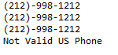

# Repository: The Numerical Library
--US Phone Parser

# What it does:
US phone numbers are organized as (XXX)-YYY-ZZZZ, where XXX is the area code, YYY and ZZZZ are your main number bodies. 

  My function <i>extractNumberFormat</i> returns the standardized US number format from the input string, such that it follows the phone format. You can omit any hyphen or the parenthesis pair, add any space among XXX, YYY, ZZZZ. However, you cannot write only half of the parenthesis pair, or add space within numbers of XXX, YYY, ZZZZ.

